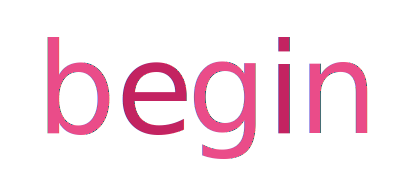

# Op Art Trivia :cyclone: :cyclone:
UT Austin Coding Bootcamp | Unit 5 jQuery timer trivia game \
[https://playeasynow.github.io/triviagame/](https://playeasynow.github.io/triviagame/) \
v1.0 \
Orig. Deployment - September 15, 2018

# Idea
My approach to each activity is to build something that will teach me something in return, in addition to the actual software tools. If you know me, you know I'm obsessed with a band named Beach House. Their latest visual album is incredible and was inspired by Bridget Riley's work from the "Op Art" movement. Enter idea to explore more Op Art contributors and hence the game!

# User Guide

Here's how it works:

- Click on "begin" to start the timed questions. You have 30 seconds to answer each question.
- If the player selects the correct answer, you'll see the winning screen. After a 3 seconds, you'll automatically proceed to the next question -- without user input.
- The scenario is similar for wrong answers and time-outs.
- If you run out of time, you'll be told and then see the correct answer. Wait 3 seconds, then you'll see the next question.
- If you choose the wrong answer, you'll be told and then see the correct answer. Wait 3 seconds, then you'll see the next question.
- On the final screen, you'll be able to review the number of correct answers, incorrect answers, timed-out questions and an option to restart the game.
- Have fun!

The game uses basic jQuery methods and timers, so good for a great first run at timed games!

# Built Utilizing: 
SVG images and animations \
Bootstrap v4 - <https://stackpath.bootstrapcdn.com/bootstrap/4.1.3/css/bootstrap.min.css> \
jQuery 3.x - <http://code.jquery.com/jquery-3.3.1.min.js> 

# Original Contributors:
Ezequiel Calderon (current edition and ongoing maintenance) - <https://github.com/playeasynow>

# Get Involved!
If you have any recommendations, let me know! Email: ezequiel.calderon.jr@gmail.com. If you'd like to take it in your own direction, go right ahead. 
